# 在STM32F407VET6上实现基于机器学习的心电信号与其他信号分类

## 1. 训练模型

### 1.1.安装Python，安装Tensorflow库

#### 1.1.1 下载并安装Python

略（参考版本：3.11）

#### 1.1.2 安装Tensorflow库

- 参考版本2.21.0
- 打开Powershell(Win+R 输入 `powershell`,回车)
- 输入`pip install tensorflow`
- 等待安装完成

- 什么是tensorflow

    >TensorFlow 是由 Google 开发的一个开源机器学习与深度学习框架，它的核心思想是用“数据流图”（Data Flow Graph）来表示计算过程：节点表示运算（如加法、卷积），边表示数据（通常是张量，Tensor）。开发者通过构建这样的计算图，就可以高效地在CPU、GPU甚至嵌入式设备上执行复杂的数值计算任务。

    >从作用上看，TensorFlow 是当前人工智能领域最重要的基础工具之一。它为研究者和工程师提供了一整套从模型设计、训练到部署的完整流程支持。在模型设计阶段，TensorFlow 提供了灵活的接口（例如其高级API Keras），可以快速搭建神经网络结构，比如卷积神经网络（CNN）、循环神经网络（RNN）等；在训练阶段，它能够自动完成梯度计算（自动微分）并利用大规模数据进行参数优化；在部署阶段，它支持将模型转换为轻量版本（如 TensorFlow Lite），运行在手机、嵌入式系统（比如你现在做的 STM32 / 边缘设备方向）甚至浏览器中。

    >在人工智能中的具体作用，可以理解为“模型的发动机”。无论是图像识别、语音识别、自然语言处理，还是你目前关注的生物医学信号分析（如心电信号识别），本质上都是在训练一个数学模型，而 TensorFlow 提供了实现这些模型的计算框架。例如，在心电信号任务中，你可以用 TensorFlow 构建一个一维卷积网络（Conv1D），输入原始ECG信号，输出分类结果（如正常/异常心律）；TensorFlow 会负责底层的矩阵运算、梯度更新以及加速执行，使你可以专注于模型结构和数据本身。

    >总的来说，TensorFlow 的意义在于：它把复杂的数学计算、硬件加速和工程部署“封装”起来，让人工智能从理论走向工程应用成为可能，也是目前深度学习能够大规模落地的关键基础设施之一。

- 可能遇到的问题
    由于现在大部分情况下使用的python环境版本为3.12+，在部分情况下，高版本python会出现与tensorflow库产生冲突导致不兼容。且对于部分老旧CPU，由于缺少AVX和AVX2指令集支持，也会出现TensorFlow 无法加载核心动态链接库的error。另外，如果Visual C++ 运行库缺失或过旧也会导致这种情况发生。目前的解决办法是：
    - 尽可能**避免**把python基础库、代码文件等相关内容安装到中文路径下；
    - 将python从高版本降到**3.9**以下（下面展示搭建虚拟环境的流程）
    ```bash
    #创建新环境
    conda create -n tf_env python=3.9 
    conda activate tf_env
    #使用Conda安装TensorFlow
    conda install tensorflow
    #运行测试
    python -c "import tensorflow as tf; print(tf.config.list_physical_devices())"
    ```
### 1.2 获取训练和测试数据

#### 1.2.1 心电信号数据

- 获取心电数据
心电数据使用来自 https://physionet.org/content/mitdb/1.0.0/ 的开源数据。该数据的频率为360Hz，分辨率为11位。该数据**不需要下载**，可直接在线读取。但若速度较慢，也可以下载到本地后，在本地读取。
``` python

import wfdb
records = wfdb.get_record_list('mitdb') # example
# ... 

if __name__ == "__main__":
    config = {
        'source': 'local',# 'network' 或 'local'
        'db_name': 'mitdb',
        'data_path': r"mit-bih-arrhythmia-database-1.0.0",# 本地模式需要；网络模式可留着不影响
        'sample_length': 360,
        'samples_per_class': 5000,
    }

    prepare_data(**config)
```
- 心电数据切片（例）
由于模型需要合理的输入，如果过短则会丢失细节，难以准确分类，过长则对缓存和计算性能要求过大，这里选择360个点（1s）作为输入。
对于每段信号，这里取通道0，按每360个点进行切片，一共取5000段。
- 归一化
每段信号单独进行归一化处理，将$(min\_val, max\_val)$映射到$(0,1)$.

#### 1.2.2 正弦信号数据

- 正弦信号生成
频率$0.5$Hz到$40$Hz内均匀随机，相位$0$到$2\pi$内均匀随机，值域映射到$(0,1)$.共生成5000条。

- 添加噪声
出于数据增广的要求，对生成的正弦信号添加$N(0,0.01^2)$的噪声

#### 1.2.3 噪声数据

- 噪声生成
直接生成$N(0.5,0.15^2)$的噪声，然后截止到$(0,1)$。共生成5000条。

#### 1.2.4 合并数据

- 将三组数据合并，然后随机打乱。之后按70%，15%，15%的比例划分训练集、验证集和测试集。

### 1.2.5 代码
- 本部分另附代码 `prepare_data.py`

### 1.3 模型生成

#### 1.3.1 模型选择
使用1D CNN卷积神经网络，实现一个简单分类模型。由于需要搭载到单片机上运行，且任务本身较为简单，因此模型也较为简单。
```python
import tensorflow as tf
from tensorflow.keras import layers, models

def build_model(input_shape):
    # 使用 Keras 的 Sequential 模型按顺序堆叠网络层
    model = models.Sequential([
        # 第一层卷积：16个滤波器，卷积核大小为5，使用ReLU激活函数
        # input_shape 应为 (360, 1)，表示1秒长度的单通道信号
        layers.Conv1D(16, kernel_size=5, activation='relu', input_shape=input_shape),
        # 第一个最大池化层：缩小特征图尺寸，降低计算量并提取显著特征
        layers.MaxPooling1D(pool_size=2),
        # 第二层卷积：增加到32个滤波器，提取更高阶的抽象特征
        layers.Conv1D(32, kernel_size=5, activation='relu'),
        # 第二个最大池化层
        layers.MaxPooling1D(pool_size=2),
        # 展平层：将多维特征向量拉直，以便连接到全连接层
        layers.Flatten(),
        # 全连接层：32个神经元，进一步进行特征组合
        layers.Dense(32, activation='relu'),
        # 输出层：3个神经元对应3个类别（ECG、正弦、噪声）
        # 使用 softmax 激活函数将输出转换为概率分布
        layers.Dense(3, activation='softmax')
    ])
    return model
```

#### 1.3.2 模型训练
```python
def train_model():
    # 1. 加载预处理好的数据（由 prepare_data.py 生成）
    # 使用 .astype 确保数据类型符合 TensorFlow 的输入要求
    X_train = np.load('X_train.npy').astype(np.float32) # 训练集特征
    y_train = np.load('y_train.npy').astype(np.int64)   # 训练集标签
    X_val = np.load('X_val.npy').astype(np.float32)     # 验证集特征
    y_val = np.load('y_val.npy').astype(np.int64)       # 验证集标签

    # 2. 确定输入形状并构建模型
    # 输入形状为 (信号长度, 通道数)，例如 (360, 1)
    input_shape = (X_train.shape[1], 1)
    model = build_model(input_shape)

    # 3. 编译模型
    # 使用 Adam 优化器，自动调整学习率
    # 损失函数使用稀疏类别交叉熵，适用于多分类任务且标签为整数
    model.compile(optimizer='adam',
                  loss='sparse_categorical_crossentropy',
                  metrics=['accuracy'])

    # 打印模型结构，查看各层参数量和输出尺寸
    model.summary()

    # 4. 开始训练
    # 训练10个轮次 (epochs)，每批处理32条数据 (batch_size)
    # 每个轮次结束后使用验证集评估性能，防止过拟合
    history = model.fit(X_train, y_train, 
                        epochs=10, 
                        batch_size=32,
                        validation_data=(X_val, y_val))

    # 5. 保存训练好的模型为 HDF5 格式
    model.save('ecg_classifier_model.h5')
    print("Model saved to ecg_classifier_model.h5")
```
#### 1.3.3 转化为tflite格式
- 把 .h5 转成 .tflite，是为了让模型能在资源受限设备上高效运行。这一步进行量化，改变算子格式，重新确定输入输出格式；最终减小模型体积，从而降低推理计算要求，使得模型可以更好部署在单片机上。

- 本部分另附代码 `export_tflite.py`

## 2 生成可以烧录的c代码

### 2.1 下载并安装STM32CubeMX和X-CUBE-AI扩展

- STM32CubeMX下载链接：https://www.st.com/en/developmenttools/stm32cubemx.html
- 安装完STM32CubeMX后，在右侧Manage software installations中，点击INSTALL/REMOVE
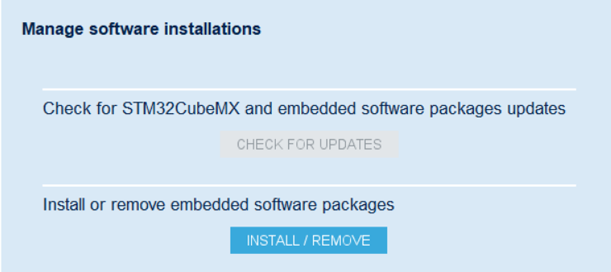
- 在弹出界面中，选择STMicroelectronics，找到X-CUBE-AI，可直接选择最新版下载（图中已下载完）。
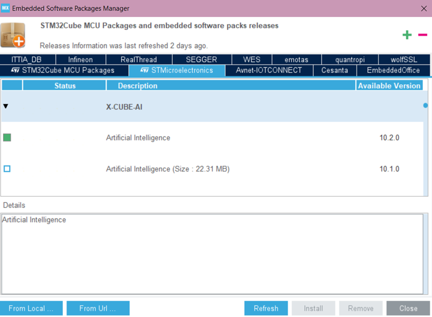

- 什么是STM32CubeMX和X-CUBE-AI
    > STM32CubeMX 是由 STMicroelectronics 提供的一款图形化配置与代码生成工具，主要用于 STM32 微控制器的工程初始化与外设管理。它通过可视化界面将原本复杂的底层配置过程简化为参数选择和功能勾选，使开发者无需直接操作寄存器或从零编写初始化代码。用户只需选择目标芯片、配置引脚复用关系以及各类外设参数，STM32CubeMX 就可以自动生成基于 HAL 或 LL 库的标准化工程代码，并支持导出到常见开发环境（如 STM32CubeIDE）。其本质作用是为嵌入式开发提供一个统一、规范的工程起点，从而提高开发效率并降低出错概率。

    > 在此基础上，X-CUBE-AI 是 STM32 生态中的一个扩展软件包，用于将机器学习模型部署到 STM32 平台上运行。它能够解析来自 TensorFlow、Keras 等框架训练得到的模型文件，并将其转换为适用于嵌入式环境的 C 语言推理代码。在转换过程中，X-CUBE-AI 会对模型进行结构解析、内存优化以及数值格式调整（如量化处理），以适应微控制器在计算能力和存储资源方面的限制。最终生成的代码可以直接集成进 STM32 工程中，在设备端完成模型的前向推理计算。

    > 两者结合时，STM32CubeMX 提供的是整体工程框架与底层硬件配置能力，而 X-CUBE-AI 则作为其中的一个功能组件，将高层的人工智能模型嵌入到该工程体系中。开发者可以在同一个工具环境中完成硬件资源配置与模型集成，使传统嵌入式开发流程与机器学习部署流程形成统一，从而实现从模型到嵌入式运行环境的衔接。整体来看，这种组合体现了将复杂的软件算法与资源受限硬件平台进行工程化融合的一种典型方法。

### 2.2 使用STM32CubeMX和X-CUBE-AI生成项目

- 在STM32CubeMX的初始页面中，新建项目部分，点击ACCESS TO MCU SELECTOR按钮。
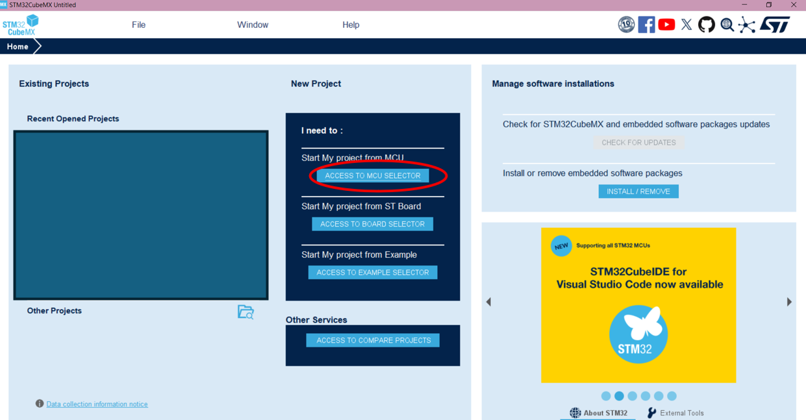

- 选择单片机为STM32F407VET6，在左侧找到Middlewares，并勾选Artificial Intelligence的Enable勾选框，选择网络为.tflite格式（注：可不选，这里只勾选Enable应该就可以），最后创建项目。
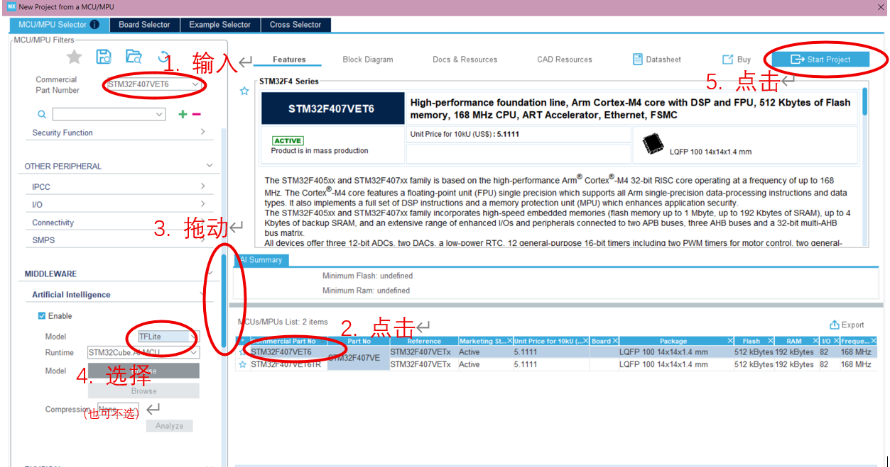

- 在左侧打开Middleware and Software Packs栏，找到X-CUBE-AI,单击进入选择页面。

- 在选择页面中，展开X-CUBE-AI下的两项，勾选Core后勾选框，将Application后的下拉框选为Application Template.然后点击OK退出。
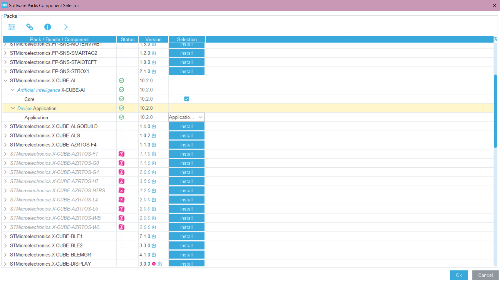

- 双击选择左栏中的X-CUBE-AI，打开配置页面，删除已有的网络（如本来就有默认网络的话，确保只剩下main）。然后新建一个网络，选择格式为TFLite，选择之前生成的模型文件，点击Analyze，等待分析完成。
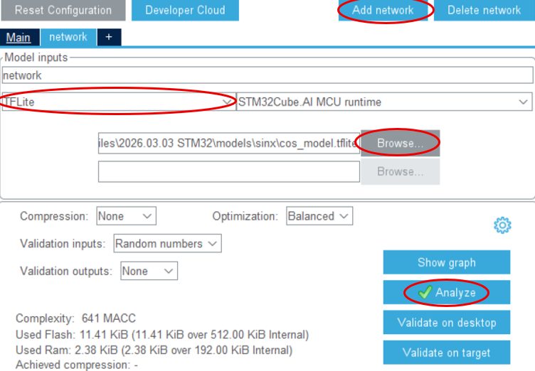

- 若无意外，此时可以点击右上角的GENERATE CODE按钮，但会进入项目设置。

- 这里要求填写项目名称，确认项目位置。此外，在项目设置中，Toolchain/IDE中，选择MDK-ARM，Min Version选择V4.这一步会在最后生成一个.lib文件，为后续编译需要的。
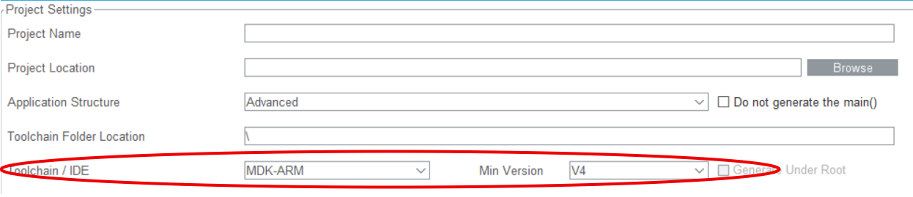

- 此时可以再次点击右上角的GENERATE CODE按钮，生成代码。

## 3 将c代码移植进项目（例程）中

### 3.1 提取上一步生成的文件中需要的部分

#### 3.1.1 文件管理
- 需要的文件包括：
    - `../Middlewares/ST/AI/Inc` 中所有文件
    - `../Middlewares/ST/AI/Lib` 中所有文件
    - `../X-CUBE-AI/App` 中除了`app_X-CUBE-AI.c`和`app_X-CUBE-AI.h`以外所有文件

- 将以上文件可以复制进一个复制的例程文件夹中，便于管理（这里使用`EXP5_串口通讯实验`）

#### 3.1.2 项目中添加文件
- 在Keil中还需要添加文件。打开例程项目，将上述的文件添加进项目中，具体操作：
    - 右击Target 1，点击Add Group，分别生成三个文件夹（需要重命名）
    - 分别将`../Middlewares/ST/AI/Inc`文件夹中所有内容、`../Middlewares/ST/AI/Lib`中所有内容、`../X-CUBE-AI/App`中除了`app_x-cube-ai.c`和`app_x-cube-ai.h`外所有内容放入一个文件夹中。
- 添加include路径，具体操作为：
    - 右击Target 1，点击options for Target...，打开选项页面
    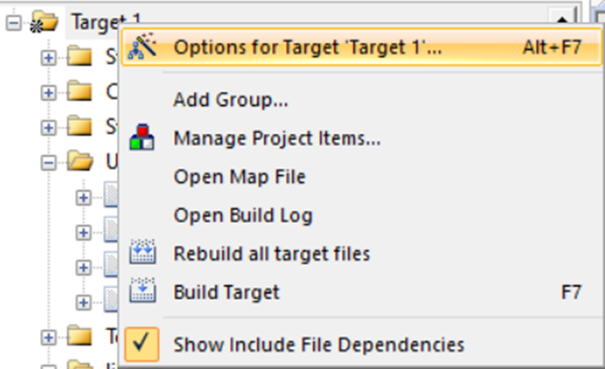
    - 选择C/C++，在Include Paths中添加前面提到的三个文件夹（建议使用已经复制到例程中的地址）
    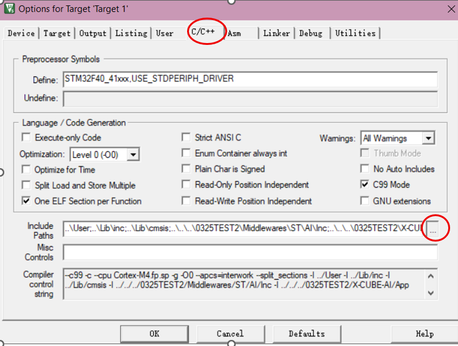

### 3.2 修改`main.c`文件和`usart.h`文件

#### 3.2.1 修改`usart.h`文件
- 将`usart.h`文件中，对应行修改为
```C
#define USART_REC_LEN 4096 // 确保读取长度足够
```

#### 3.2.2 修改`main.c`文件

- 函数可定义在其他文件中，为了避免过于复杂，这里直接放在`main.c`中
- 其主要任务为：
    - 串口接收符合格式（包含帧头）的 原始数据/已经归一化的浮点数 数组
    - 对数据进行预处理，包括数据合法性判断、归一化计算
    - 使用神经网络计算预测结果
    - 串口发送预测结果和概率
- 本部分另附代码`main.c`

## 4 运行项目

### 4.1 Build并下载程序

略

### 4.2 运行和结果

- 上位机软件代码`ecg_stm32_viz.py`，可以读取当前目录下的`X_test.npy`数据和`y_test.npy`数据。上位机绘制原始波形，并转化为正确格式的数组通过串口发送。发送后，可接受下位机从串口发送的结果并显示，本地存储的答案也一并显示。
- 可能需要`pip install pyserial`
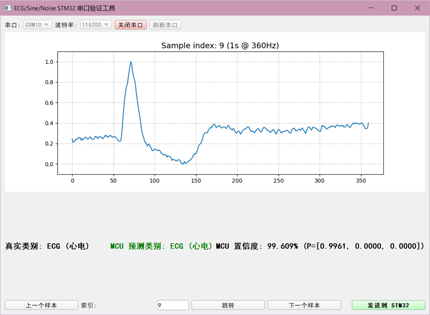
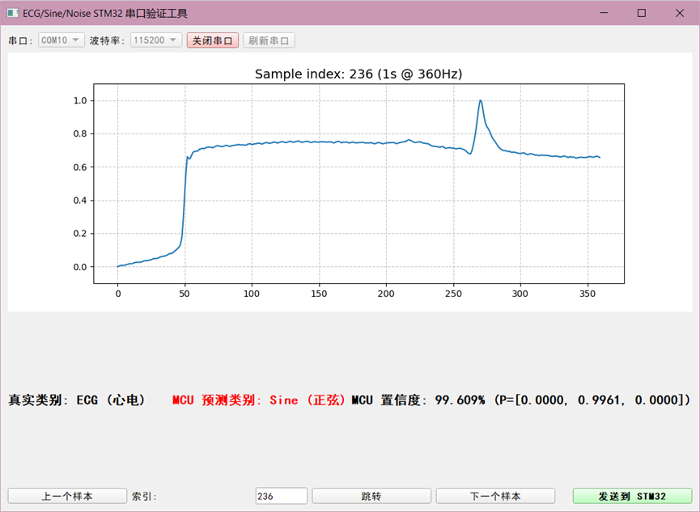
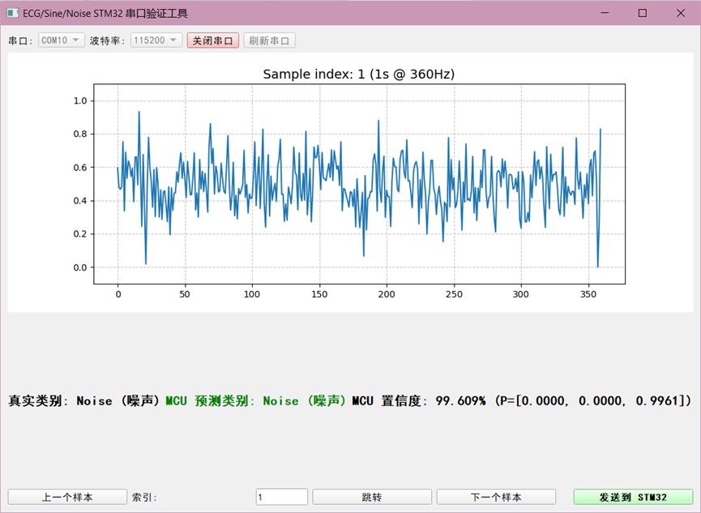
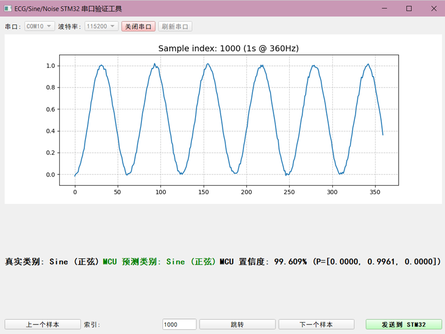

## 5 附录列表

1. `prepare_data.py` 准备数据
2. `train_model.py` 搭建并训练模型
3. `export_tflite.py` 将模型转换成tflite格式
4. `ecg_stm32_viz.py` 上位机软件，用于验证
5. stm32项目
